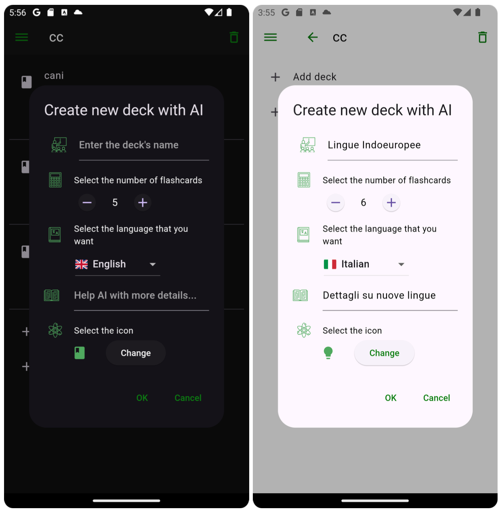
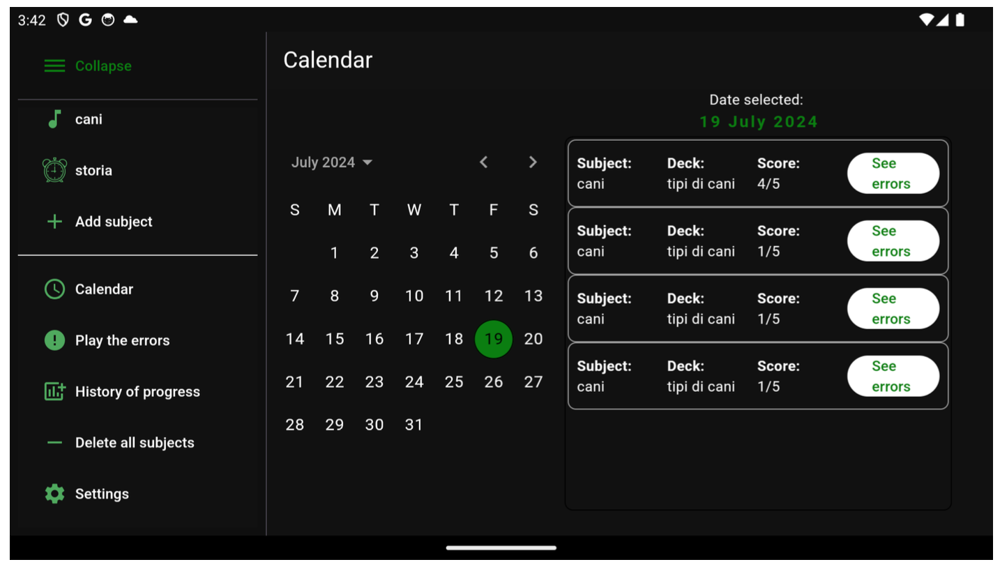
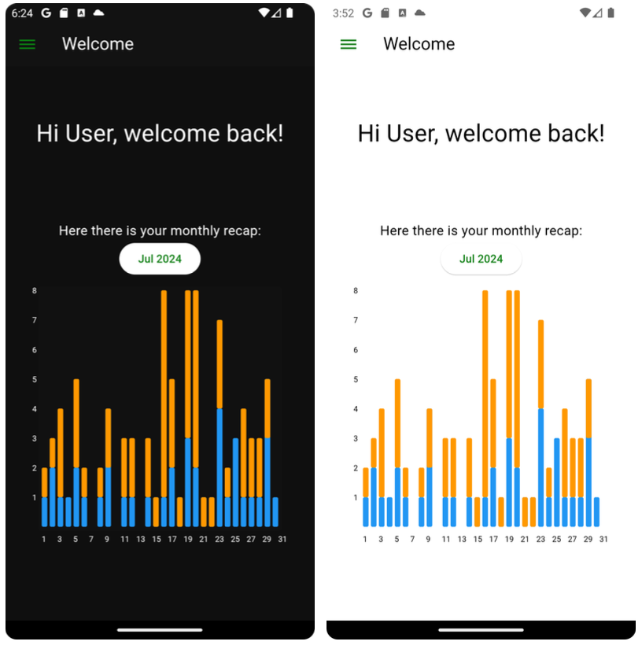
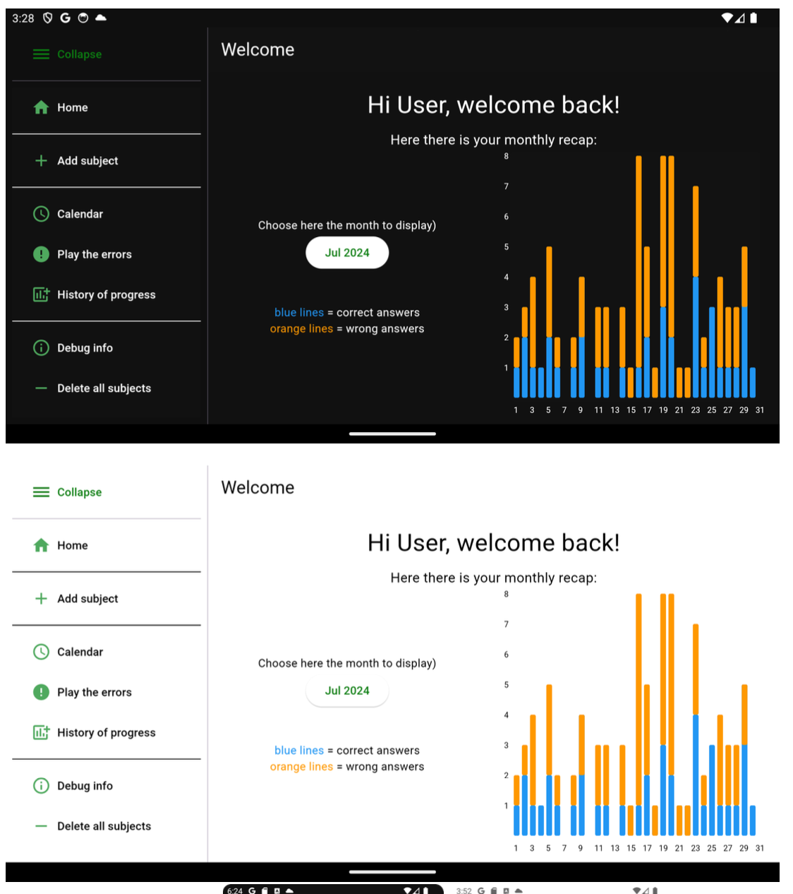

# FlashcardsAI

**FlashcardsAI** is a Flutter mobile app designed to revolutionize studying and memorization through the flashcard method, enhanced by AI. Create, manage, and play decks within intuitive interfaces—let the app’s AI generate and explain flashcards, track personal performance, and synchronize data across devices using Firebase.

---

## Features

- **AI-Assisted Deck Creation**: Instantly create study decks with AI (ChatGPT) by specifying subject, number of cards, and description.
- **Automatic Explanations**: Get instant, insightful explanations for mistakes from ChatGPT to understand and learn efficiently.
- **Personalized Progress Tracking**: Monitor statistics, error history, and session recaps using histograms and calendars.
- **Custom Organization**: Create, edit, and manage decks (called “subjects”), flashcards, and personal records with customizable icons.
- **Seamless Cloud Sync**: Authenticated with Firebase (Google/Firebase Auth); all decks/subjects backed up for interoperability.
- **Offline Mode (Partial)**: Most features available offline, except for AI functionalities and backup/restore.
- **Flexible UI/UX**: Material Design, responsive to device and theme (light/dark), and multi-device support.
- **Extensive Testing**: Robust suite of model and widget tests.
- **Future-Proof Roadmap**: See `DD_dima.pdf` for deep architecture and planned features (multi-language, images, chat).

---
## Screenshots

Below are key screenshots demonstrating FlashcardsAI features. All screenshots show the platform on both light and dark modes or different device sizes where appropriate.

| Create Deck with AI                | Calendar Widget                  | Custom App Icon                |
|------------------------------------|----------------------------------|-------------------------------|
|  |  |  |

| Subject Selection Page             | Welcome Screen (Mobile)           | Welcome Screen (Tablet/Desktop) |
|------------------------------------|-----------------------------------|---------------------------------|
|  |  |  |

> _Screenshots are from various stages of app usage (creating a deck, calendar view, home, welcome, etc.). For best quality, make sure to add these files in the repository under `/screenshots` exactly as named above._


---

## Getting Started

### Prerequisites

- [Flutter 3.x](https://flutter.dev/docs/get-started/install)
- Firebase project (Android: add `google-services.json` to `/`)
- OpenAI API key for ChatGPT features

### Setup
 ```
git clone https://github.com/YOUR_USERNAME/flashcardsai.git
cd flashcardsai
flutter pub get
### Add google-services.json to the root for Firebase
### Configure iOS/web as needed
flutter run
```


---

## How to Use

- **Sign Up / Login**: Via email-password or Google authentication.
- **Add Decks/Subjects**: Create manually or use “AddDeckWithAI” dialog for instant AI-powered decks.
- **Study Sessions**: Play decks, reveal answers, mark responses as correct/wrong, and review mistakes.
- **Error Insights**: Use calendar/history to revisit errors and let ChatGPT explain them for deeper understanding.
- **Data Synchronization**: Back up and restore decks via Firebase for multi-device access.
- **Personalize Settings**: Change API key, theme, and more in Settings.

---

## Testing

Tests for models, repository service, and key UI widgets are included under `/test` and can be run with:


---
```
flutter test
```

## Contributing

Contributions are welcome!  
- Open issues/feature requests for discussion.
- Create pull requests for direct improvements.

---

## License

This project is licensed under the MIT License.

---

## Documentation

Check out [`FlashcardAI DD.pdf`](./FlashcardAI%20DD.pdf) for full architecture diagrams, model details, and the future roadmap.

---

*Made by Giacomo Verdicchio & Lorenc Leci, Politecnico di Milano (2023-2024)*


